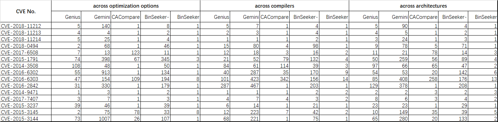

### BinSeeker: Semantic Learning and Emulation Based Cross-platform Binary Vulnerability Seeker

    We list detailed search results as follows. For each vulnerability, the following figure shows the search ranking from three aspects: across optimization options, across compilers and across architectures. It is used as a supplement to the Section III-B1 on page 6 of the paper.
    

